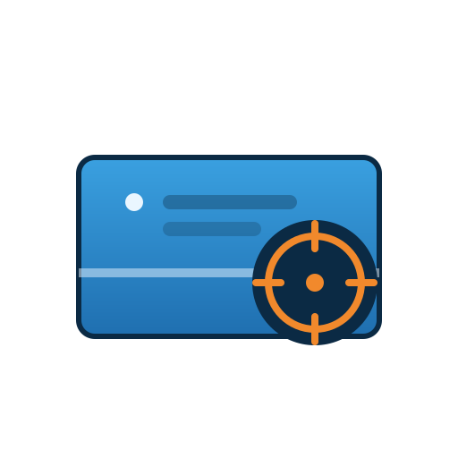

<p align="center">
  
</p>

# Parity Spot Check for Unraid

Continuously spot-checks your array's parity in the background: it picks a
random location on the array, runs Unraid's own parity-check engine over
just that stretch, pauses, picks a new random location, and repeats —
indefinitely, until you turn it off.

Copyright © 2026 Ray Munro. Licensed under the [GNU GPLv3](LICENSE).

## How it works

Unraid's `mdcmd check` supports an optional starting sector offset
(`mdcmd check NOCORRECT <offset>`). Parity Spot Check uses exactly that
official interface — it does not reimplement parity math or read disks
directly. Each cycle it:

1. Confirms the array is started, the parity disk is reporting `DISK_OK`,
   and no other check/rebuild is already running.
2. Picks a random sector offset within the parity-covered range.
3. Starts a **read-only** (`NOCORRECT`) check at that offset.
4. Polls `/var/local/emhttp/var.ini` until roughly the configured "spot
   size" of data has been verified, then pauses the check (`mdcmd nocheck`).
5. Records the result (mismatches found, if any) and rests for the
   configured interval before picking a new random offset.

## Safety

- **Always NOCORRECT.** This plugin never writes to parity and has no
  setting to enable correcting mode. It only ever reports mismatches.
- **Never interferes with a real check.** If a parity check or disk
  rebuild is already running (started by you or by Unraid itself), the
  daemon waits — it never cancels or takes over someone else's operation.
- **Stopping is immediate.** Disabling the plugin or stopping its service
  always issues `mdcmd nocheck`, so an in-flight spot check is paused
  right away, not left running in the background.
- If a mismatch is found, Unraid sends a Warning notification through
  your configured notification agents. Investigate before running a
  normal correcting parity check yourself from the Main page.

## Limitations

- The random-offset behaviour depends on `mdcmd check` honouring the
  optional offset argument. This is confirmed present in current Unraid
  releases; if your version predates it, spot checks will effectively
  always start from sector 0. Check the system log
  (`logger -t parity-spotcheck`, visible in Tools → System Log) to
  confirm offsets are actually varying.
- A parity check reads all data/parity disks together for each stripe, so
  spot checks exercise the whole array at that offset, not one disk.
- Live array writes during a spot check can, in rare cases, look like a
  false-positive mismatch — the same caveat that applies to any Unraid
  parity check run while the array is in use.
- Counters and history on the settings page are kept in memory/tmpfs and
  reset on reboot or plugin restart; the system log is the durable trail.

## Installation

**Via Community Applications:** search for "Parity Spot Check" in the Apps
tab and click Install.

**Manually:** in the Unraid webGUI go to **Plugins → Install Plugin** and
paste:

```
https://raw.githubusercontent.com/RayMunro/unraid-parity-spotcheck/main/parity-spotcheck.plg
```

or from the terminal:

```bash
plugin install https://raw.githubusercontent.com/RayMunro/unraid-parity-spotcheck/main/parity-spotcheck.plg
```

Then open **Settings → User Utilities → Parity Spot Check**, set a spot
size and rest interval, and enable it. Everything the plugin needs is
written by the `.plg` itself, so nothing else needs to be downloaded or
copied by hand.

## Configuration

- **Spot size (MB)** — how much of the array each spot check covers
  (default 1024 MB / 1 GB).
- **Rest between spot checks (seconds)** — idle time between spots so
  disks aren't hammered continuously (default 300s).

## Uninstall

From Settings → Plugins, remove "parity-spotcheck" normally, or run:

```bash
plugin remove parity-spotcheck.plg
```

Any in-flight spot check is paused automatically as part of removal.
